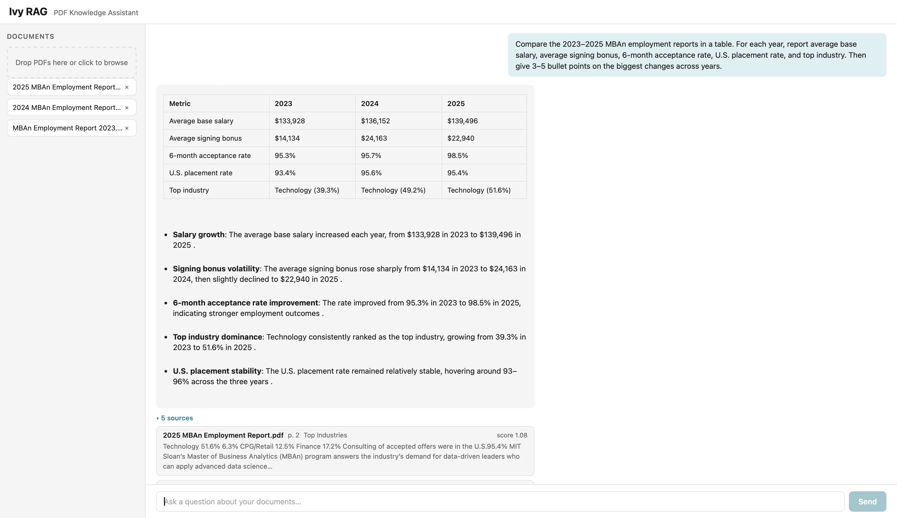

# Ivy-RAG

A lightweight PDF question-answering system built with FastAPI, React, and Mistral.  
Upload one or more PDFs, ask questions over the document set, and get answers grounded in retrieved passages with citations.

The project is intentionally simple: retrieval is implemented directly in Python, storage is local, and the system refuses to answer when the evidence is too weak.

---

## What it does

- Ingests PDF files and chunks them with document and page metadata
- Classifies each question before retrieval — simple chat never hits the index
- Retrieves evidence with hybrid dense + keyword search, then reranks results
- Generates cited answers grounded in retrieved passages
- Returns an insufficient-evidence response when retrieval is weak, rather than guessing

---

## How it works

1. PDFs are parsed page by page and split into overlapping chunks with heading and page metadata.
2. Each chunk is embedded with `mistral-embed` and indexed for both dense and keyword (BM25) retrieval.
3. At query time, the question is classified into an intent (chat, lookup, list, table, summary, or unsafe). Chat responses skip retrieval entirely.
4. The question is transformed before search — a short hypothetical answer is embedded for dense retrieval, and filler words are stripped for BM25.
5. Dense and BM25 results are merged with Reciprocal Rank Fusion, then reranked with MMR for diversity.
6. If the top retrieved evidence scores fall below calibrated thresholds, the system responds with an insufficient-evidence message. Otherwise, the LLM generates a cited answer.
7. Each sentence of the response is verified against the retrieved evidence. Sentences that are not supported are flagged in the UI — amber for unmentioned, red for contradicted.

---

## Design choices

**Hybrid retrieval**  
Dense retrieval captures semantic similarity; BM25 catches exact terms, names, and abbreviations. The two ranked lists are merged with RRF, which is rank-based and does not require calibrating the scale difference between cosine and BM25 scores.

**No external vector database**  
The system uses local files and NumPy-based storage. Every retrieval step is a few lines of Python and directly inspectable. Dense search is implemented directly with NumPy, and embeddings are stored in a lightweight memory-mapped format.

**Refusal over guessing**  
Before generation, top-1 and average top-3 cosine scores are checked against thresholds measured from answerable vs. unanswerable queries. When the evidence is thin, the assistant returns a clear refusal rather than hallucinating.

**Per-sentence hallucination check**  
After generation, each sentence is embedded and compared against the retrieved chunks. Sentences below a similarity threshold are sent to Mistral with a targeted prompt — *does the source support, contradict, or not mention this?* — and flagged accordingly.

---

## Example

After uploading three years of MBAn employment reports:

> *Compare the 2023–2025 MBAn employment reports in a table. For each year, report average base salary, average signing bonus, 6-month acceptance rate, U.S. placement rate, and top industry. Then give 3–5 bullet points on the biggest changes across years.*

The system retrieves relevant passages from each document, generates a Markdown table, and adds cited takeaways — returning an insufficient-evidence response if the documents do not support the question.



---

## Project structure

```
Ivy-RAG/
├── backend/
│   ├── app/
│   │   ├── ingestion/      # PDF parsing and chunking
│   │   ├── retrieval/      # Embeddings, BM25, RRF, MMR
│   │   ├── generation/     # Prompts, LLM calls, hallucination verifier
│   │   ├── query/          # Intent detection, policy filter, query transform
│   │   ├── storage/        # In-memory index and file persistence
│   │   └── main.py
│   ├── scripts/
│   │   └── calibrate_thresholds.py
│   ├── tests/
│   └── requirements.txt
├── frontend/
│   └── src/
├── Dockerfile.backend
├── Dockerfile.frontend
├── docker-compose.yml
├── nginx.conf
└── .env.example
```

---

## Running locally

**Prerequisites:** Python 3.9+, Node 18+, a [Mistral AI API key](https://console.mistral.ai)

```bash
git clone https://github.com/ivyxuxt/Ivy-RAG.git
cd Ivy-RAG
cp .env.example .env
# Add your MISTRAL_API_KEY to .env
```

**Backend**
```bash
cd backend
pip install -r requirements.txt
uvicorn app.main:app --reload   # http://localhost:8000
```

**Frontend** (new terminal)
```bash
cd frontend
npm install
npm run dev                     # http://localhost:5173
```

**Docker (full stack)**
```bash
docker compose up --build
# Frontend → http://localhost:3000
# Backend  → http://localhost:8000
```

**Tests**
```bash
cd backend
MISTRAL_API_KEY=test FRONTEND_ORIGIN=http://localhost:5173 python -m pytest tests/ -v
```

---

## API

| Endpoint | Method | Purpose |
|---|---|---|
| `/ingest` | POST | Upload PDF files (`multipart/form-data`, field `files`) |
| `/query` | POST | Ask a question (`{"question": "...", "top_k": 5}`) |
| `/documents` | GET | List ingested documents |
| `/documents/{doc_id}` | DELETE | Remove a document and its chunks |
| `/health` | GET | Liveness check |
| `/ready` | GET | Reports chunks loaded |

---

## Stack

| Layer | Tools |
|---|---|
| Backend | FastAPI, Uvicorn, pypdf, NumPy, slowapi, httpx |
| Retrieval | Custom BM25, cosine search, RRF, MMR — no external RAG library |
| LLM | Mistral AI (`mistral-embed`, `mistral-small-latest`) |
| Frontend | React, Vite, TypeScript, react-markdown |
| Deployment | Docker, docker-compose, Nginx |

---

## Frontend

The frontend is a simple chat interface for uploading PDFs, asking questions, viewing citations, and seeing unsupported claims flagged in the response. It is built with React and Vite and communicates with the backend over HTTP.

The backend includes upload validation, rate limiting, and CORS configuration, and can optionally require an API key via `X-Api-Key`.

---

## Limitations

- Dense search scans the full embedding matrix (exact cosine). Fine for document-scale corpora; approximate nearest neighbor would be needed at larger scale.
- Storage is single-process and in-memory backed by local files. Not suitable for concurrent multi-user production use.
- PDF extraction quality depends on the source file. Scanned or image-only PDFs will not extract meaningful text.

